# This fork contains...

Primarily **sample precision note playback**, i.e. the ability to play a note at any point in the bar, mainline LMMS forces all notes to be synced to 1/192th of a bar.

Sample precision note playback enables

- Recording with no quantizing
- Groove quantizing i.e. Swing (the difference between house and techno)

## Recording with no quantizing

Set the BPM for your track  
Open the piano roll  
Turn off Quantizing  
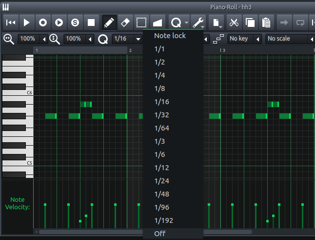

wire up a midi keyboard hit record, and play on the keyboard.  This fork alo has auto-wiring of a default midi-keyboard, if its detected.

N.B. Your PC keyboard and midi stack will add latency, no attempt is made to compensate for latency, my setup gives millisecond precision like this. YMMV.

Notes are recorded with their midi position and the offset from that position, you can move notes around, and they keep their offsets but this makes very little sense.  If you move notes around you probably want to remove the offset for the note you are moving Quantize >> Remove groove.  
You can make very subtle movements in the position of notes in Piano roll after recording with Quantize >> Nudge forward and Quantize >> Nudge back

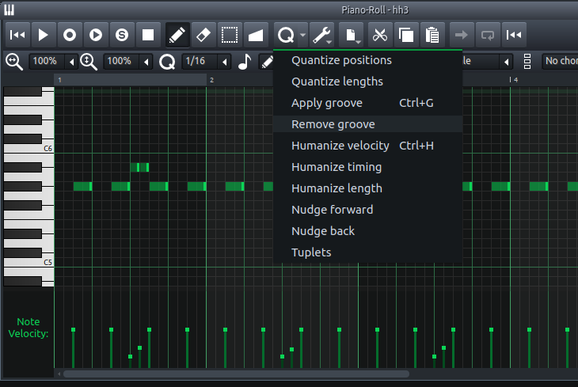

N.B. changing BPM a lot after recording, will probably not behave as expected.

## Groove quantizing

Essentially writing house/funky music becomes really easy.

There are a few experimental groove option but **Hydrogen Swing** is the familiar groove that will you find in a classic 808 or Rolands more modern syths, often called just "swing".

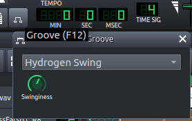

Its called Hydrogen Swing because the algorithm mimics the Hydrogen drum machine swing algorithm.

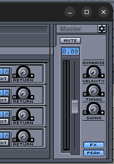

This is the same algorithm as 808 and other hardware synths.

When writing a drum pattern or melody the Swing algorithm makes subtle changes to notes placed on the 2nd and 4th quartile of a beat, only the notes highlighted below will be affected.

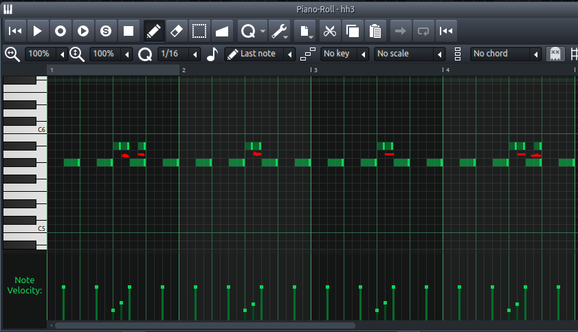

The notes underlined in red will receive a slight delay proportional to the "Swinginess" knob in the Groove dialog.  Higher Swinginess is a longer delay for each note.

This delay is applied to all the notes or the selected notes in the currently open piano roll when you type Ctrl + G or select Quantize >> Apply groove.

As with recordings made without quantizing , groove quantization behave weirdly if you change BPM after applying groove to notes.  If you track does change BPM reapply groove to notes in affected clips.

[More info on Swing](https://en.wikipedia.org/wiki/Swing_%28jazz_performance_style%29)

Swing algorithms in this fork only support 4/4 time signature.

## Humanize

**Humanize timing** Makes subtle timing randomization to selected notes, that uses the sample precision offsets in this fork.

**Humanize velocity** makes subtle randomization to the velocity (volume) of each note and **Humanize length** makes not-so-subtle changes to the note length.

## Tuplets

Tuplets allows spacing notes equally within a bar, select more than one note and choose Quantize >> Tuplets and the notes will be equally spaced with in the bar.  This feature uses sample precision timing, so same caveats about BPM changes apply after creating notes this way.

N.B. if you select 3 notes, i.e. to create triplets, or 4, these will be precisely positioned without offsets, if you select 5 or 7 sample precision offsets are used.

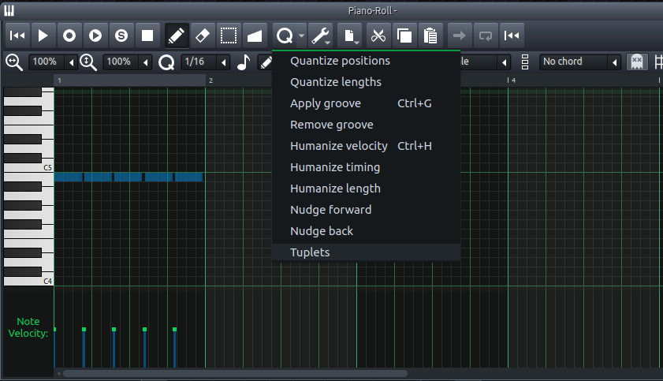

## Other features in this fork

* Sub notes
    * Define some notes as main/regular notes and some as flam/sub/ghost notes
    * Ability to visualize them draw them and select them together
    * Ability to adjust the volume and panning and swing/groove, of each type
    * Alt + Q sets selected notes as sub notes
    * Alt + W set notes as regular
    * Alt + S selects all sub notes
    * Alt + N selctes all normal notes
* AudioFileProcessor - has next/prev for quickly trying out different drum samples.
* Triple Oscilator - has next/prev for source wavs
    * also supports a single bezier wave oscilator.
* Voxpop - sampler instrument designed for playing voice samples
    * playback from different places in the sample
    * pitch and/or time stretch
    * playback points (cue sheet) edited in Audacity (save labels as a .txt file)
* Xone - Allen & Heath mixer style LPF effect
* Ability to save and load presents for all LMMS effects.
* Export improvements
    * Ctrl + E to export without popups (using configured defaults)
    * Ctrl + B to bounce selected clips to loop file
    * Saving meta data to MP3 / Ogg / Wav files, e.g. title, author, genre
    * Save images to MP3 files e.g. album art (limited to one 128k image)
    * Setting for default output format preferences
* External sample editor - e.g open sample in Audacity
* TCO changes
    * double a clips length
    * index selected clips e.g.  bd1 bd2 bd3 bd4
    * fade in & fade out notes in a clip, without an automation track!
    * create flams and 2 types of sequenced echos
    * fade in and fade out also available for selected notes inthe piano roll
* Ducking controller
	* A smooth advanced sidechain, using crazy bezier math
* Physical Midi Controller
    * Use a phsical midi controller to navigate in LMMS
* Tap reverb plaugin, has text telling you what reverb you are using.

## Directory selector

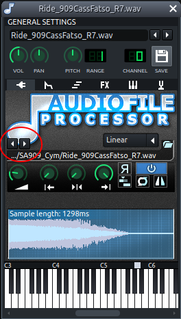
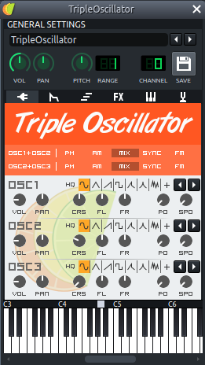

## Voxpop

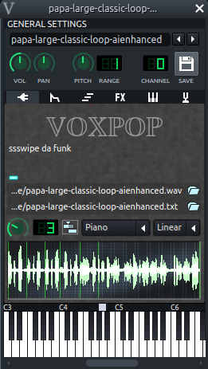

Makes playing a single sample with words or phrases that you want to sync to the music, a lot easier
than inporting one sample per word or line, or presyninc whole wav tracks.

## BezierSynth

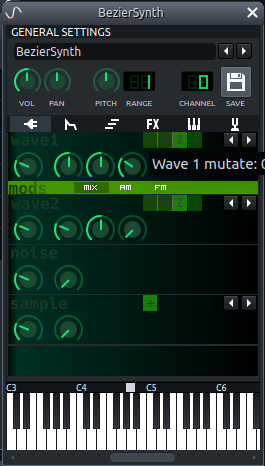

A whole new way to generate waves and modulate/mutate them.  Its a polyphonic synth that uses math to draw sound instead of samples or wavetables.

You can draw the shape of the sound you want in a graphical editor, I use Inkscape, and then import that sound wave into the synth.
Each wave has a modulation algo, so you can twiddle a knob and mutate the sound shape as it plays.

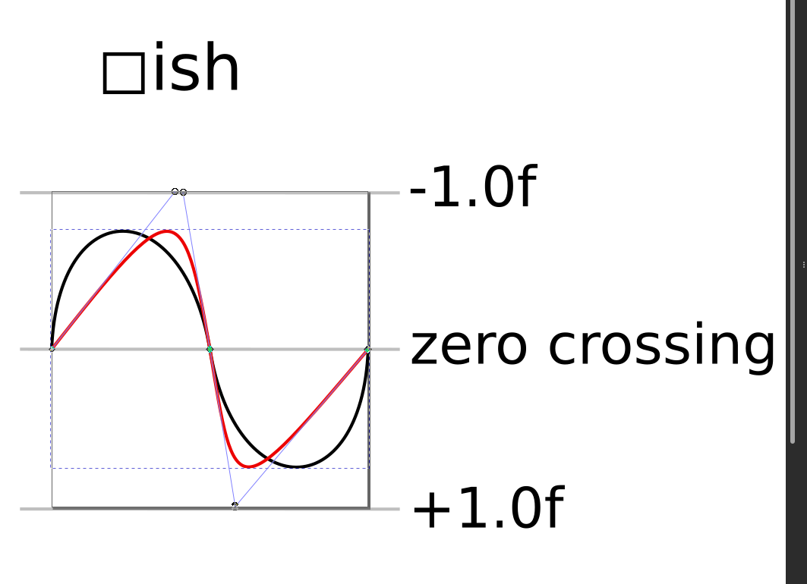

## Bezier ducking

Same bezier math used for a ducking controller, gives a tighter, more clubby/punchy duck than using sin waves, or side chaining of kicks.
The curve was drawn in Inkscape and converted to C++ algo and then a custom Controller built  for the controller rack.
Same effect an be achieveed with automation tracks but its fiddly, lots of copy paste and takes up screen real-estate, the controller rack lives in the back ground and is much more convenient.

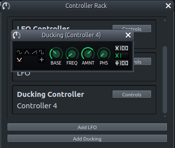

## Xone filter

Crossover filter plus wild (resonance), automatable, and tweaked to sound like the Xone filter that if you are a DJ you will be used to having 
on DJ mixers.
Writing electronic musinc without this is painful, I use it a lot. All instruments support this out of the box in LMMS, with a bit of fiddling
but this plugin enables using it on grouped mixer channers, or even the whole mix, and before or after effects.  Particularly its useful
to put an expander after the Xone FX so as freq rises volume doens't tail off.

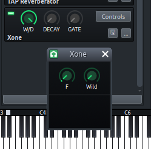

## Mp3 images

Save idv3 tract title artist and image, direct from the LMMS project export.  No need to use a tag editor.
I use this always because I often tweak tunes and then rsync to the Internet, and don't want to go through a process to master and export and compress and add images each time I twiddle the mix of a high hat.

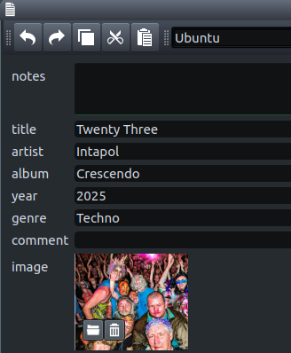

## Studio Controller

I use a physical midi controller to navitage LMMS instead of trying to remember all the key strokes.

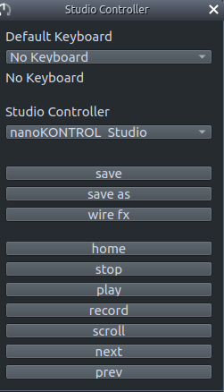

## Midi keyboard

I have a phsycal midi keyboard that auto wires to the piano roll when even it opens.  No need to fiddle with the assingments.
I also I have permanent mapping from the mixer rack to a physical midi mixer.

## Sub notes

Ability to write two types of note in the piano roll, main notes and sub notes. N.B these are often called ghost notes but 
LMMS uses the term for something else. Useful for writing pre-echos that you can then fiddle with as a group.  Especially useful 
for writing layered notes where one note is placed exactly on top of the other, and it then becomes fiddly to select.
Enables easily visualising which notes are principal to a melody and which are for skip or emphasis or trill or echo.
Editing in the piano rolls in significantly easier with the ability to instantly select sub notes (Alt+S) and tweak volume of all notes together.

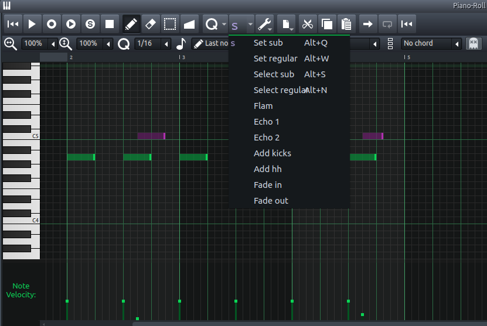

## Ideal eq curve is draw on to the spectrum analiser
 
This making it easy to see visually when some frequencies are missing, while mixing.  Its a fully opinionated curve obviously. based on averaging some eq curves of mastered tracks released on Beatport.  As good a reference as any for electronic music.

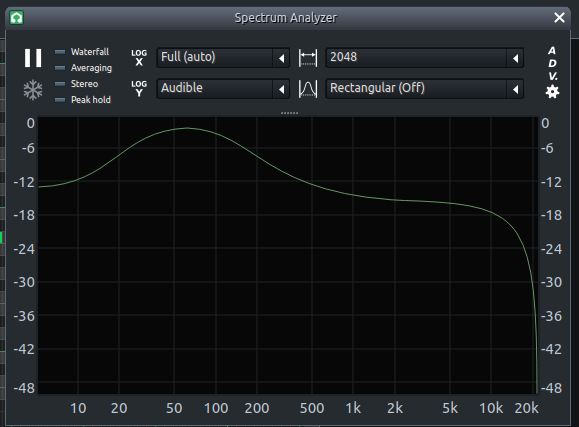
